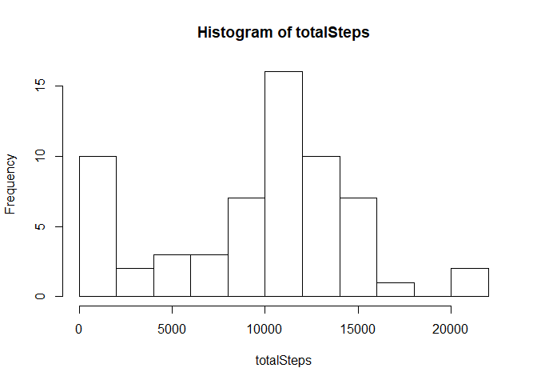
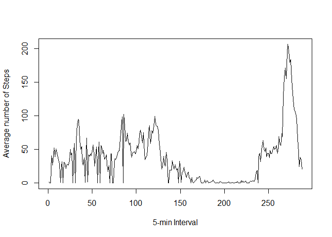
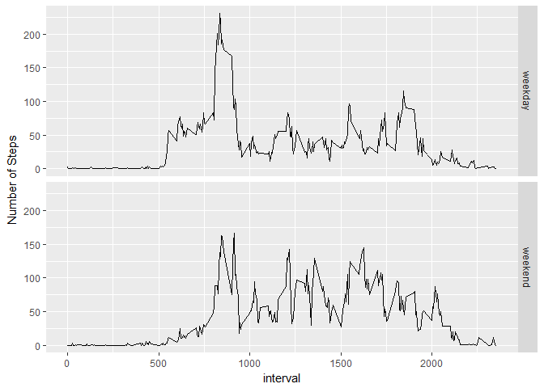

Reproducible Research Peer-Graded Assignment 1
================================================

**Related Code and Results**

**Loading data**

Assignment step 1


```r
data <- read.csv("activity.csv")
```

Data is read with the code above. No additional transformation was made at this point.
It will be made in the following steps if needed.


**Histogram of the total number of steps taken each day**

Assignment step 2


```r
totalSteps <- as.numeric(with(data, tapply(steps, as.character(date),sum,na.rm=TRUE)))
hist(totalSteps,breaks = 10)
```

<!-- -->

Histogram of the total number of steps taken each day is above.


**Mean and median number of steps taken each day**

Assignment step 3


```r
meanSteps <- mean(totalSteps)
medianSteps <- median(totalSteps)
```
The mean of steps taken each day are 9354.2295082

The median of steps taken each day are 1.0395\times 10^{4}


**Time series plot of the average number of steps taken**

Assignment Step 4


```r
average5min <- with(data, tapply(steps, as.character(interval),mean,na.rm=TRUE))
plot(average5min, type = "l", xlab="5-min Interval",ylab="Average number of Steps")
```

<!-- -->
Above it shows how the mean of steps taken changes during 5 min intervals.


**The 5-minute interval that, on average, contains the maximum number of steps**

Assignment step5


```r
max5 <- which.max(average5min)
max5Int <- names(max5)
```

The 5 min interval with the highest mean of steps is  835


**Code to describe and show a strategy for imputing missing data**

Assignment Step 6


```r
nas <- sum(is.na(data$steps))
naInd <- which(is.na(data$steps))
dataMod <- data
for(i in 1:length(naInd)){
  int <- as.character(data$interval[naInd[i]])
  dataMod$steps[naInd[i]] <- average5min[as.character(int)]
}
```

There were 2304 NA steps at the data. Those values were replaced, using the code above, with the mean of the interval that the value was missing. A new data frame was created named *dataMod* .


**Histogram of the total number of steps taken each day after missing values are imputed**

Assignment step 7

```r
totalStepsMod <- as.numeric(with(dataMod, tapply(steps, as.character(date),sum)))
hist(totalSteps,breaks = 10)
```

<!-- -->

```r
meanStepsMod <- mean(totalStepsMod)
medianStepsMod <- median(totalStepsMod)
```

Above is the histogram of steps taken after the missing values are replaced with means.

Mean of steps has changed to 1.0766189\times 10^{4}

Median of steps has changed to 1.0766189\times 10^{4}


**Panel plot comparing the average number of steps taken per 5-minute interval across weekdays and weekends**

Assignment step 8

```r
library(lubridate)
```

```
## 
## Attaching package: 'lubridate'
```

```
## The following object is masked from 'package:base':
## 
##     date
```

```r
library(dplyr)
```

```
## 
## Attaching package: 'dplyr'
```

```
## The following objects are masked from 'package:lubridate':
## 
##     intersect, setdiff, union
```

```
## The following objects are masked from 'package:stats':
## 
##     filter, lag
```

```
## The following objects are masked from 'package:base':
## 
##     intersect, setdiff, setequal, union
```

```r
days <- weekdays(ymd(as.character(dataMod$date)))
for(i in 1:length(days)){
  if(days[i]=="Saturday" | days[i]=="Sunday"){
    days[i] <- "weekend"
  }
  else{
    days[i] <- "weekday"
  }
}
dataMod$weekdays <- as.factor(days)
dataMod$avOfInt <- rep(0,nrow(dataMod))
weekdayAv <- with(filter(dataMod,weekdays=="weekday"),tapply(steps, as.character(interval),mean))
weekendAv <- with(filter(dataMod,weekdays=="weekend"),tapply(steps,as.character(interval),mean))
for(i in 1:nrow(dataMod)){
  if(dataMod$weekdays[i]=="weekday"){
    dataMod$avOfInt[i] <- weekdayAv[as.character(dataMod$interval[i])]
  }
  else{
    dataMod$avOfInt[i] <- weekendAv[as.character(dataMod$interval[i])]
  }
}

#Plot
library(ggplot2)
g <- ggplot(dataMod,aes(interval,avOfInt))
g + geom_line() + facet_grid(weekdays~.) + labs(x= "interval") + labs(y="Number of Steps")
```

<!-- -->

The modified data is separated into two groups, weekends and weekdays, according to date.
2 plots of the mean number of steps taken are provided, to compare weekday and weekend activity. 


